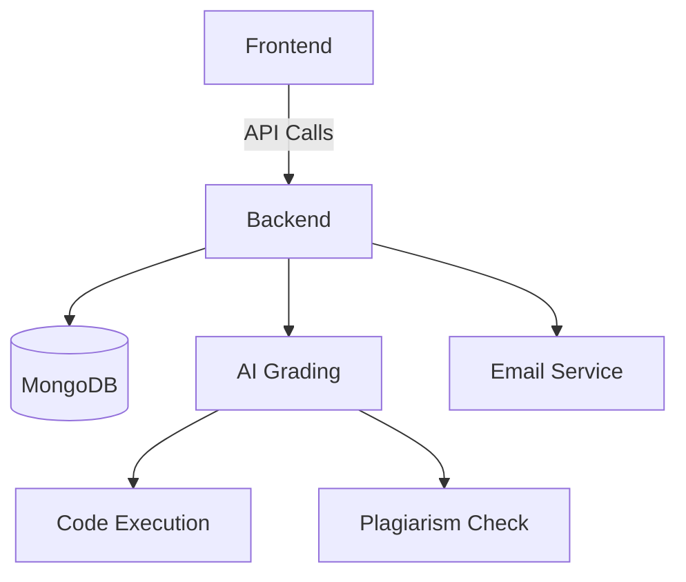

Here's an enhanced version of your README with icons, deployment badges, and visual elements:

````markdown
# 🚀 SkillSync Hire - AI-Driven Skill Assessment Platform

[](https://easy-hire-seekers.netlify.app/)
[](https://render.com/)
[](https://opensource.org/licenses/MIT)

 <!-- Add real screenshots -->

## 🌟 Key Features

### 👨💻 For Candidates

| Feature               | Icon | Description                                      |
| --------------------- | ---- | ------------------------------------------------ |
| **Skill Assessments** | 📝   | Real-time coding challenges with AI evaluation   |
| **Progress Tracking** | 📊   | Interactive dashboard with performance analytics |
| **Anonymous Apply**   | 🎭   | Apply without resume bias using skill badges     |

### 👩💼 For Recruiters

| Feature               | Icon | Description                                     |
| --------------------- | ---- | ----------------------------------------------- |
| **Smart Screening**   | 🔍   | AI-powered candidate ranking system             |
| **Collaboration Hub** | 👥   | Team notes & candidate comparison tools         |
| **Plagiarism Check**  | ✅   | Code similarity detection with MOSS integration |

---

## 🛠 Tech Stack

### Frontend


### Backend


### DevOps


---

## 🚀 Live Deployment

| Environment | URL                                                                              | Status                                                                     |
| ----------- | -------------------------------------------------------------------------------- | -------------------------------------------------------------------------- |
| Frontend    | [https://easy-hire-seekers.netlify.app/](https://easy-hire-seekers.netlify.app/) |  |
| Backend API | [https://api-skillsynchire.onrender.com](https://api-skillsynchire.onrender.com) |                   |

---

## 📊 System Architecture


````

---

## 🛠 Local Setup

```bash
# Clone repository
git clone https://github.com/yourusername/skillsync-hire.git
cd skillsync-hire

# Backend setup
cd backend
npm install
echo "PORT=5000\nMONGO_URI=mongodb://localhost:27017/skillsynchire" > .env
npm start

# Frontend setup (in new terminal)
cd ../frontend
npm install
npm run dev
```

---

## 🤝 Contributors

| [](https://linkedin.com/in/sakshi) | [](https://linkedin.com/in/hari) |
| -------------------------------------------------------------------------------------------------------- | ---------------------------------------------------------------------------------------------------- |
| **Sakshi Kumari**<br>[📧](mailto:sakshikumarizen@gmail.com)                                              | **Hari Om**<br>[📧](mailto:hari333333om@gmail.com)                                                   |

---

## 📜 License

This project is licensed under the MIT License - see the [LICENSE](LICENSE) file for details.


```

**To complete this README:**
1. Replace placeholder images with actual screenshots
2. Add proper status badges from Netlify/Render
3. Update architecture diagram with your actual services
4. Add real contributor profile photos and LinkedIn URLs
5. Include actual license file

Would you like me to help create any specific visual assets or diagrams for your project? 🎨
```
